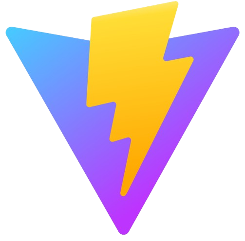

 

🌈 I am Thomas, a passionate Software Developer from France.
 
💼 In addition to my current position at Frigate, I am working on my first e-commerce website.
 
🌱 I am currently learning Redux
 
💬 Besides Javascript, I speak fluent French, English & Spanish (and some German too)

## Connect with me:

## 🛠 Tech stack:

	
	&nbsp;
	&nbsp;
	&nbsp;
	&nbsp;
	&nbsp;
	&nbsp;
	&nbsp;
	&nbsp;
	&nbsp;
	&nbsp; 
	&nbsp;
	&nbsp;
	&nbsp;
	&nbsp;
	&nbsp;
	&nbsp;
	&nbsp;
	&nbsp;
	&nbsp;
	&nbsp;
		&nbsp;

 

## GitHub Stats:

 

## Check out my portfolio website:

https://thomasaugot.com/

## Don't miss my blog articles, and follow me!

    
&#128240 <b>Latest Blogs Posts</b>
 

- [How to Start Scroll at Bottom in React](https://medium.com/@thomasaugot/how-to-start-scroll-at-bottom-in-react-901ba21cd720)
- [.dotenv Environment Variables in Next.JS Not Found: The Solution](https://medium.com/javascript-in-plain-english/dotenv-environment-variables-in-next-js-not-found-the-solution-7edf248c06be)
- [Adding Zoom Functionality to an Image Viewer in React/Next.JS](https://medium.com/@thomasaugot/adding-zoom-functionality-to-an-image-viewer-in-react-next-js-4621be8eb770)
- & more at https://medium.com/@thomasaugot

    
&#127942 <b>GitHub Awards</b>
 

    
👨‍💻 <b>My Projects</b>
 

** This list doesn't include projects for which I am not the owner of the rights **

- Wave Rider | Surf Shop   Repo client: https://github.com/thomasaugot/wave-rider-ecommerce , Demo: https://wave-riders-ecommerce.vercel.app/
- Charpente Menuiserie Durand   Repo client: https://github.com/thomasaugot/charpente-menuiserie-durand , Demo: https://www.cmdurand.fr/
- Todayzzz todos   Repo client: https://github.com/thomasaugot/typescript-todo-app-frontend , Repo server: https://github.com/thomasaugot/ts-todo-app-backend , Demo: https://todayzzz-todos.netlify.app/
- Kingpad   Repo: https://github.com/thomasaugot/kp-next.js , Demo: https://kingpad-v1-1-new-figma.vercel.app/
- Farmhouse Table   Repo: https://github.com/thomasaugot/farmhouse-table-website , Demo: https://farmhouse-table.netlify.app/
- Javascript Shooting Game, Rick vs Rats   Repo: https://github.com/thomasaugot/project-js-shooting-game , Demo: https://pickle-rick-shooting-game.netlify.app/
- Partymates   Repo client: https://github.com/thomasaugot/app-partymates-client , Repo server: https://github.com/thomasaugot/app-partymates-server , Demo: https://partymates.netlify.app/
- The Broke Globetrotter   Repo: https://github.com/project-web-app-cities/the-broke-globetrotter , Demo: https://the-broke-globetrotter.adaptable.app/

